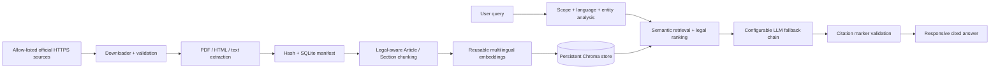

# Pakistan Legal & Constitutional AI Assistant

A production-oriented foundation for a source-grounded Pakistani legal-information service. The application accepts plain English, Urdu, Roman Urdu, and mixed-language questions; rejects unrelated requests; retrieves official-source evidence; and produces cited explanations without presenting itself as a lawyer.

The system is intentionally not a general chatbot. Its authority comes from indexed Pakistani government and judicial material, not from an LLM's memory.

## Purpose

Pakistani legal material is often difficult for citizens, students, and researchers to locate and understand. This project provides a focused conversational layer over a controlled, traceable knowledge pipeline while preserving the source URL, document hash, status notes, and provision metadata used for each answer.

## Architecture



The application is a modular monolith: the API, retrieval, embeddings, vector store, provider chain, catalog, and ingestion pipeline have separate interfaces, but deployment remains simple. Expensive embedding resources are cached and are not reloaded per request. Ingestion is never performed during chat.

## Technology

- Python 3.12, FastAPI, Pydantic
- LangChain embedding/document integration
- Chroma persistent vector store (replaceable behind `VectorStore`)
- Sentence Transformers multilingual embeddings
- SQLite ingestion/catalog manifest
- Provider chain for Groq, Gemini, Hugging Face, and local Ollama
- Dependency-free semantic HTML/CSS/JavaScript frontend
- pytest and Playwright browser validation

## Directory structure

```text
backend/app/
├── api/             # routes and dependency factories
├── core/            # environment configuration and JSON logging
├── embeddings/      # reusable embedding factory
├── ingestion/       # source policy, downloader, extractor, chunker, pipeline
├── llm/             # provider abstraction and failover chain
├── models/          # internal legal-document model
├── rag/             # entities, prompts, retrieval/orchestration, citations
├── schemas/         # validated API contracts
├── security/        # scope guard, headers, rate limiting
├── services/        # language detection and SQLite catalog
├── vectorstore/     # vector-store interface and Chroma implementation
└── main.py           # FastAPI entry point and static frontend serving
frontend/
├── assets/app.js
├── assets/styles.css
└── index.html
tests/
├── responsive.spec.cjs
├── test_api.py
├── test_ingestion.py
├── test_rag.py
└── test_scope_guard.py
ingest.py
update_knowledge.py
```

## Official-source policy

Enabled seed connectors are:

- National Assembly of Pakistan: the located official Constitution PDF is retained in configuration but disabled and labeled historical because its cover says it is modified only up to 31 March 2017. It is not presented as the current operative consolidation.
- Pakistan Code, Ministry of Law and Justice: the federal-legislation portal and its Pakistan Penal Code document are enabled. The portal itself warns that content is under review and refers users to the relevant Gazette when doubt exists, so the connector preserves that limitation rather than silently upgrading portal content to Gazette authority.

The Supreme Court judgments index is included but disabled until its access policy, pagination, and document discovery behavior are confirmed. Add sources only in `backend/app/ingestion/sources.json`; the downloader accepts HTTPS URLs on an explicit Pakistani official-domain allow-list and refuses private/local addresses, unexpected redirects, and oversized documents. It does not bypass authentication, CAPTCHAs, robots restrictions, or rate limits.

## Installation

```powershell
python -m venv .venv
.\.venv\Scripts\Activate.ps1
python -m pip install --upgrade pip
python -m pip install -r requirements-dev.txt
Copy-Item .env.example .env
```

Linux/macOS activation is `source .venv/bin/activate`; copy configuration with `cp .env.example .env`.

The first embedding operation downloads the configured Sentence Transformers model. For offline deployment, pre-cache the model and point `EMBEDDING_MODEL` to it.

Python 3.12 requires the Chroma 1.x dependency line used by this project. Older
`chromadb<1` releases may try to compile `chroma-hnswlib` locally and fail when
Microsoft C++ Build Tools are not installed.

## Environment configuration

All settings are read from environment variables or `.env`. Keys are never committed. At minimum, review:

- `APP_ALLOWED_ORIGINS` and `APP_RATE_LIMIT_PER_MINUTE`
- `INGEST_USER_AGENT` (include an accountable contact URL in production)
- `EMBEDDING_PROVIDER` / `EMBEDDING_MODEL`
- `EMBEDDING_FALLBACK_PROVIDER` (`hashing` keeps the system usable when native ML libraries are unavailable)
- `LLM_PROVIDER_CHAIN`
- provider API keys, or `OLLAMA_BASE_URL` and `OLLAMA_MODEL`

No LLM API key is required for extractive, evidence-only responses. Ollama is attempted locally only after configured remote providers. The hashing fallback is deterministic and multilingual at character level, but transformer embeddings provide better semantic recall when the host permits their native dependencies.

## Initial ingestion and updates

Review each official URL and its status metadata before the initial run:

```powershell
python ingest.py
```

Force reprocessing only when intentionally rebuilding chunks:

```powershell
python ingest.py --force
```

Incremental update check:

```powershell
python update_knowledge.py
```

The pipeline applies timeouts, bounded retries, a request delay, content-size limits, extraction validation, SHA-256 hashing, source-level replacement, and a SQLite manifest. Unchanged hashes are skipped. Failures are logged and appended to `data/failed_documents.jsonl`; successful documents and chunks are counted in the command report.

## Start the application

Backend and production frontend (recommended; one origin):

```powershell
python -m uvicorn backend.app.main:app --host 127.0.0.1 --port 8000 --reload
```

Open `http://127.0.0.1:8000`. API documentation is available at `/api/docs` outside production.

Static frontend preview only (chat API will not be proxied):

```powershell
python -m http.server 5173 --directory frontend
```

Container deployment:

```powershell
docker compose up --build
```

## API

- `GET /health` — lightweight process health; does not load the embedding model
- `POST /api/chat` — validated structured chat response
- `GET /api/sources` — indexed source catalog
- `GET /api/sources/{id}` — source details and preserved metadata
- `GET /api/system/status` — document count and knowledge readiness

Example response fields are `answer`, `scope`, `grounding`, `sources`, `language`, `request_id`, and `disclaimer`. `grounding` distinguishes `rag`, `partial_rag`, `unverified_llm`, and `none`.

## Retrieval and citation safety

The request path validates input, classifies scope, detects language, extracts Article/Section/Act entities, expands the semantic query, retrieves candidates, applies a relevance floor, boosts exact legal-entity matches, selects context, calls the provider chain, and validates source markers.

Each displayed citation is constructed from indexed metadata—not generated text. Unknown model markers such as `[S9]` are removed. If no indexed evidence exists, the answer has no source objects and is explicitly labeled unverified; if every provider fails, the API returns a safe inability-to-verify response. Retrieved content is delimited as untrusted data and cannot override the system/scope instructions.

## Language handling

Unicode Urdu-script detection and Roman Urdu intent signals guide response style. English legal terms can remain intact when that protects precision. Exact provision recognition supports forms such as `Article 25`, `Section 302 PPC`, `PPC 302`, and `dafa 302`; the entity layer is deliberately extensible for a trained multilingual classifier later.

## Security and operations

- Allow-listed HTTPS ingestion and DNS/private-address checks reduce SSRF risk.
- Request validation, maximum query length, bounded history, rate limiting, narrow CORS, CSP, clickjacking, MIME-sniffing, referrer, and permissions headers are enabled.
- Exceptions return generic messages; stack traces, secrets, prompts, and filesystem paths are not exposed.
- Structured JSON logs include event type, provider fallback, retrieval/LLM/total latency, document/chunk counts, and failures; they never intentionally include API keys.
- `data/` persists separately and is ignored by Git. For multi-worker production, replace the in-memory rate limiter with Redis and SQLite with PostgreSQL or another shared database.

## Tests

Backend and core behavior:

```powershell
python -m pytest
```

Responsive browser suite (after starting the API and installing Playwright):

```powershell
$env:TARGET_URL='http://127.0.0.1:8000'
npm install
npx playwright install chromium
npm run test:e2e
```

Equivalent direct invocation:

```powershell
$env:TARGET_URL='http://127.0.0.1:8000'
node tests/responsive.spec.cjs
```

The browser suite covers 320, 375, 430, 768, 1024, 1366, 1440, and 1920 pixel widths; mobile full-screen and desktop panel behavior; open/close controls; Enter and Shift+Enter; long answers and citations; overflow; API errors; and duplicate-submit prevention.

## Responsive and accessibility behavior

The page is mobile-first. The assistant becomes full-screen at narrow widths or short heights and uses `100dvh` plus safe-area insets; desktop retains a bounded floating panel. Content uses flexible sizing, wrapping, touch-sized controls, semantic landmarks, an accessible dialog, labels, a live conversation log, visible focus styles, Escape-to-close, and reduced-motion support.

## Known limitations and scale path

- Seed discovery is intentionally small. It does not yet crawl every statute, amendment, Gazette issue, High Court, or judgment index.
- OCR is not included; image-only PDFs fail extraction and are reported rather than silently indexed.
- The rule-assisted scope and language classifiers are conservative. They can be replaced with multilingual classifiers behind the current interfaces.
- The in-process rate limiter is appropriate for one instance only.
- Chroma and SQLite are local-first. Larger deployments can add a queue for ingestion, object storage for originals, PostgreSQL metadata, Redis caching/rate limiting, and a managed vector database without rewriting the RAG service.
- Legal status must be confirmed from official Gazette/version metadata. The application never infers repeal, amendment, or currency from a filename alone.

## Legal-information disclaimer

This application provides educational and informational material. It does not create a lawyer-client relationship, replace a qualified lawyer, guarantee outcomes, or provide representation. For urgent, personal, or high-stakes matters, verify the official text and consult a qualified Pakistani legal professional.
